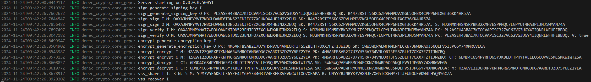

# DeRec Cryptography in grpc docker server

This repo contains the grpc server which serves common cryptographic utilities needed to implement DeRec.

The docker image of this project can be used as side car for bigger projects that depend on DeRec protocol and are not written in Rust or Java.

## Run grpc server

### Run from source

```
cargo run
```

### Run from docker

```
docker run -p 50051:50051 scholtz2/derec-crypto-core-grpc
```

## Example



## Client example

See dotnet folder
